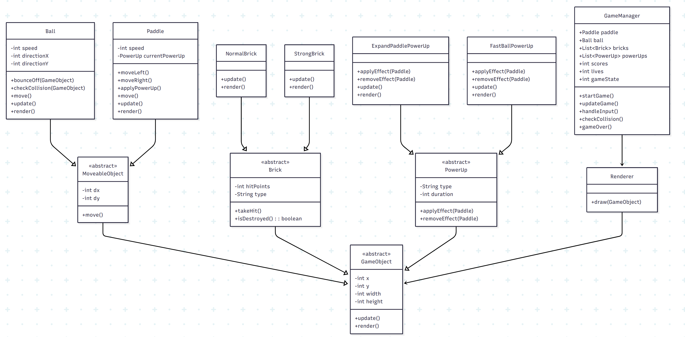

# Arkanoid

## 👨‍🏫 Giới thiệu
Đây là bài tập lớn môn Lập trình Hướng đối tượng (OOP).  

## Biểu đồ cây
    
## 📂 Cấu trúc thư mục

    Arkanoid/
    └── src/
        └── com/arkanoid/
            ├── core/
            │   └── GameManager.java       // Quản lý logic chính của game: khởi tạo, vòng lặp game, cập nhật trạng thái
            │
            ├── objects/
            │   ├── GameObject.java        // Lớp cha trừu tượng cho tất cả đối tượng trong game (có vị trí, kích thước, render)
            │   │
            │   ├── bricks/
            │   │   ├── Brick.java         // Lớp cha cho các loại gạch (có máu, va chạm với bóng)
            │   │   ├── NormalBrick.java   // Gạch thường, bị phá hủy sau 1 lần va chạm
            │   │   └── StrongBrick.java   // Gạch bền hơn, cần nhiều lần va chạm mới vỡ
            │   │
            │   ├── moveable/
            │   │   ├── Ball.java          // Quản lý bóng: di chuyển, va chạm với tường/gạch/paddle
            │   │   ├── MoveableObject.java// Lớp cha cho đối tượng có thể di chuyển (có vận tốc, hướng di chuyển)
            │   │   └── Paddle.java        // Thanh trượt điều khiển bởi người chơi, hứng bóng
            │   │
            │   └── powerups/
            │       ├── ExpandPaddlePowerUp.java // Power-up: làm paddle dài ra
            │       ├── FastBallPowerUp.java     // Power-up: tăng tốc độ bóng
            │       └── PowerUp.java             // Lớp cha cho tất cả power-up (có hiệu ứng, thời gian tồn tại)
            │
            └── render/
                └── Renderer.java          // Xử lý việc vẽ các đối tượng game ra màn hình

